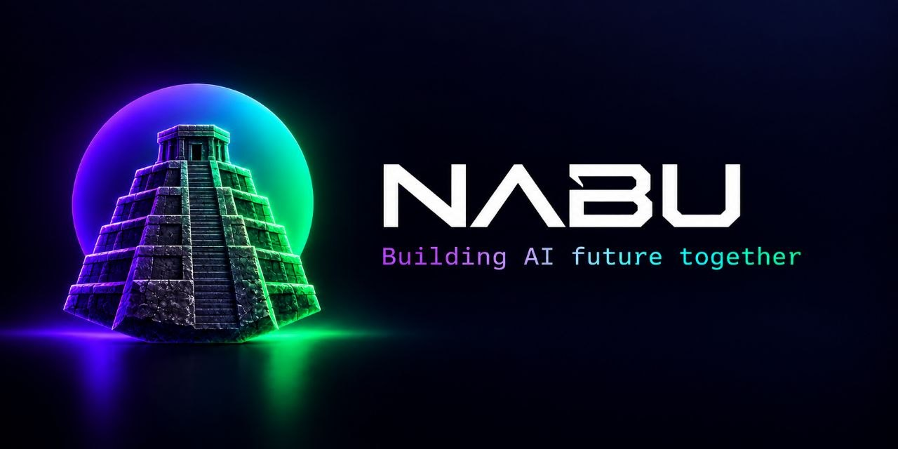

<p align="center">
  
</p>

# Nabu

**Nabu is an on-premises platform of AI agents for a company: every employee gets a personal agent
with memory, a workspace and the company's tools, reachable from the web, Telegram and the company's
own products; teams get service agents that other systems call through an API.**

A personal agent keeps one main conversation and topics, remembers facts about its user, works with
files in a personal sandbox, runs scheduled tasks and uses connections from the company catalog
(MCP servers, skills) with the user's own credentials. Service agents run on behalf of products such
as [Hammurapi](../hammurapi): a product starts a run, Nabu executes it with the product's tools and
streams the events back. Administrators choose the models, the harness, the catalog and the clients,
and see usage and an audit trail of every tool call.

This repository holds the **documentation, Helm charts and the deploy tooling**. The code lives in two
sibling repositories:

| Repository | What it is |
| --- | --- |
| [`nabu-core`](../nabu-core) | Backend: one Go binary with the modes `api`, `worker`, `agent`, `relay`, `sandbox`, `migrate`, `cleaner`; the release image carries the Pi agent |
| [`nabu-web`](../nabu-web) | Frontend: React single-page app (chat, memory, space, tasks, connections, administration) |
| `nabu` (this one) | Docs, charts `nabu-core` and `nabu-web`, `bin/nabu-deploy`, the reusable deploy workflow |

The specification is `FTR.NAB.CMN-0001` in [`hammurapi-specs`](../hammurapi-specs/specs/NAB/CMN/FTR.NAB.CMN-0001).

## Features

- **Personal agent** — a name and a tone chosen by the user, a model from the allowed list, a main
  conversation shared by all channels and topic conversations; voice input.
- **Memory** — facts the agent saves and the user can read, edit and delete; they shape every answer.
- **Space** — a personal sandbox pod with the user's files, synchronized with object storage; the agent
  reads, writes and runs commands there.
- **Tasks** — one-off and recurring tasks of the personal agent; the result lands in the main conversation.
- **Connections** — a catalog of MCP servers and skills; personal credentials (OAuth or tokens) or
  platform ones; read-only items expose only reading tools.
- **Channels** — the web, Telegram (linked by a one-time code) and products through delegation
  (`Nabu-On-Behalf-Of`), for example the chat of Hammurapi.
- **Service agents** — agents with their own instructions, models, tools and limits, started by clients
  through `/client/v1/agents/{name}/runs`; an external workspace (the client's runner) connects over the
  `relay` WebSocket channel, so it needs no inbound port.
- **Administration** — users, models and connections to LLMs, the harness (system prompt, tools), the
  catalog, service agents, API clients, usage and audit.

## Architecture

```text
             web (nabu.<domain>)                     Telegram, products (Hammurapi)
                    │                                              │
          ┌─────────▼──────────────────── nabu-api.<domain> ───────▼──────────┐
          │ api: site, admin, /client/v1, OAuth, JWKS ── Kafka ── worker:     │
          │      MCP proxy, built-in MCP                          turns, tasks,│
          │                                                       runs, sandbox│
          │ relay: WebSocket channel of workspaces  ◄──────────── agent: Pi   │
          └───────────────▲───────────────────────────────────────────────────┘
                          │ wss
        personal sandboxes (nabu-sandboxes)   ·   runners of service agents
```

Postgres (CloudNativePG), Kafka (Strimzi) and S3 (SeaweedFS) are those of the stand. Pi runs in the
agent operator, one process per session; tools that touch files go to the workspace through `relay`.

## Deployment

On the Hammurapi stand Nabu is deployed into the same minikube, namespaces `nabu` and
`nabu-sandboxes`, by GitHub Actions: a tag `vX.Y.Z` of `nabu-core` or `nabu-web` builds and signs the
image and calls `deploy-component.yml` of this repository, which runs `bin/nabu-deploy` on the machine.
Sign-in is GitHub restricted to an organization (or any OIDC provider). See
[docs/deployment.md](docs/deployment.md) and [docs/configuration.md](docs/configuration.md).

## Documentation

- [Deployment](docs/deployment.md) — the stand, organization variables and secrets, the GitHub OAuth App, releases
- [Configuration](docs/configuration.md) — every environment variable of `nabu-core`
- [Connecting Hammurapi](docs/hammurapi.md) — the client, the catalog item and service agents for Hammurapi
